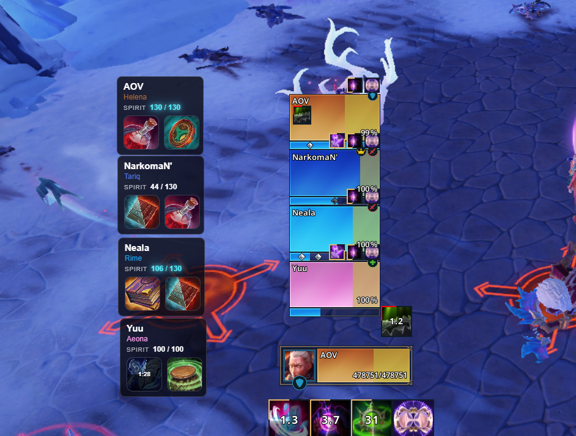

# Fellowship Overlay

Lightweight in-game overlay for tracking party members, relics, and Spirit values in real time using combat logs.

## Features

- Real-time player tracking from log file
- Displays:
  - Player name and class
  - Spirit (numeric only)
  - Equipped relics with cooldown visualization
- Smart Spirit highlighting based on relic bonuses
- Draggable UI
- Minimal and compact layout for in-game usage

## Controls

- **F8** — Lock / Unlock overlay (enable/disable dragging)
- **F9** — Select log file

## Screenshot



## Installation

**Requirements:**
- Node.js 20

**Setup & Run:**
```bash
npm i          # install dependencies
npm start      # run in development mode
npm run dist   # build application