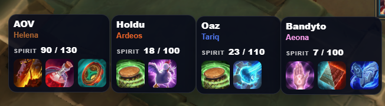
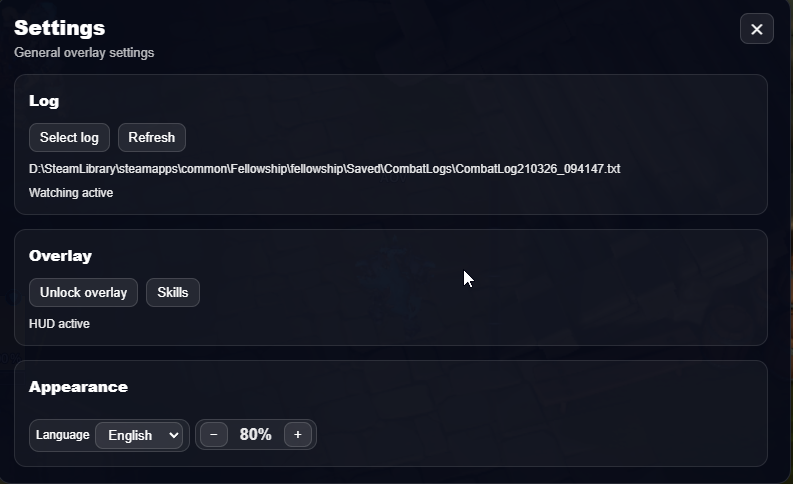
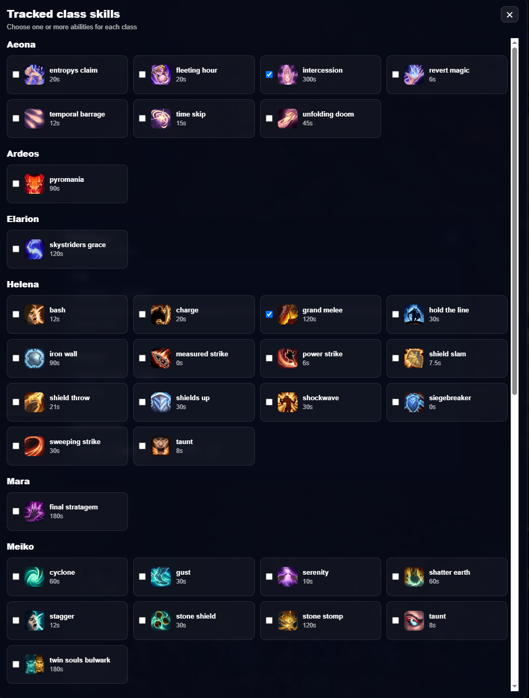

# Fellowship Overlay

Lightweight in-game overlay for tracking party members, relics, Spirit values, skill cooldowns, and recent actions in real time using combat logs.

## Join the Community

**Discord community:** [https://discord.gg/82BeHyQEeR](https://discord.gg/82BeHyQEeR)

## Features

- Real-time player tracking from the combat log
- Displays:
  - Spirit (numeric only)
  - Equipped relics with cooldown visualization
  - Selected skill cooldowns based on gem bonuses
  - Recent Skills
  - Pack percent (in dev)
- Smart Spirit highlighting based on gem bonuses
- Draggable UI
- Tray icon with access to settings

## How Overlay Input Works

The overlay can work in two modes:

- **Locked overlay**
  - The overlay is **click-through**
  - All mouse clicks pass through the overlay into the game
  - Use this mode while playing normally

- **Unlocked overlay**
  - The overlay is **not click-through**
  - The overlay captures mouse input
  - Use this mode when you want to drag or interact with overlay elements

## Controls

- **F8** — Toggle overlay lock state
  - When the overlay is **locked**, it passes all clicks through to the game
  - When the overlay is **unlocked**, it does **not** pass clicks through
- **F9** — Select log file

## Tray

The application also runs in the **system tray**.

From the tray you can open the app and access **settings**.

## Screenshots





## Installation

**Requirements:**
- Node.js 20

**Setup & Run:**
```bash
npm i          # install dependencies
npm start      # run in development mode
npm run dist   # build application
```
